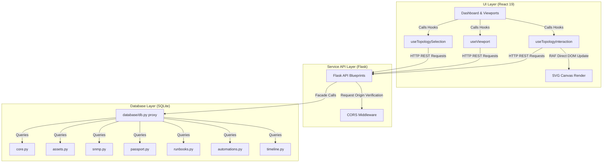

# InfraGuard


> **Enterprise IT Infrastructure Visibility Platform** built with React, Flask, SQLite, and Network Discovery Engines.

InfraGuard is a high-performance IT Infrastructure Visibility Platform designed for defensive asset discovery, structured inventory management, real-time status monitoring, network topology tracing, interactive troubleshooter runbooks, and automated health audits.

---

## ⭐ Highlights

- **Defensive Network Discovery:** Subnet scanner detecting active network entities with zero-overhead ICMP/ARP probes.
- **Interactive Topology Visualization:** 60FPS pan-and-zoom layout engine using isolated React hooks and `window.requestAnimationFrame` DOM state commits.
- **Infrastructure Passports:** Structured physical location tags (building, rack, slot) and contract parameters (AMC, warranty, lifecycle).
- **Interactive Troubleshooter Runbooks:** Sequence-guided diagnostic templates (Ping probes, TCP socket checks, Wake-on-LAN broadcasts).
- **Modular Database Facade:** Clean repository pattern separating domain modules (Assets, SNMP, Runbooks, Passports) behind `database/db.py`.
- **Production Diagnostic Telemetry:** Standardized `/api/health`, `/api/version`, and `/api/system` telemetry endpoints with CORS protection.

---

## 🏛️ System Architecture

The diagram below outlines the runtime data flow and separation of concerns inside the InfraGuard codebase:



---

## 🛠️ Local Development & Setup

### Prerequisites

- Node.js 20+
- Python 3.12+

### 1. Project Installation

Install all root workspace and sub-workspace dependencies in one command:

```powershell
npm install
```

### 2. Running the Platform

Start the frontend (Vite) and backend (Flask) development servers concurrently:

```powershell
npm run dev
```

- **Frontend Webapp:** `http://localhost:5173`
- **Backend Server:** `http://localhost:5000`
- **API Health Monitor:** `http://localhost:5000/api/health`

### 3. Alternative Launch Scripts (Windows)

Double-click files located in the `tools` directory to execute background tasks:

- `tools\start.bat` - Starts dev servers and opens the browser.
- `tools\stop.bat` - Cleanly stops all active dev servers.

---

## 🧪 Verification Gates

Verify codestyle and build status before committing logic changes:

```powershell
# Format codebase using Prettier
npm run format

# Run ESLint validation checks
npm run lint

# Run Vite frontend production build check
npm run build:frontend

# Run full project verify pipeline
npm run verify
```

To run python database and endpoint verification suites:

```powershell
backend\.venv\Scripts\python.exe tests/test_db_split.py
backend\.venv\Scripts\python.exe tests/test_endpoints.py
```

---

## 🌐 Production Deployment

### Backend Deployment (Render)

1. Connect your GitHub repository to your Render dashboard.
2. Create a new **Web Service**.
3. Set the environment settings:
   - **Runtime:** `Python`
   - **Build Command:** `pip install -r backend/requirements.txt`
   - **Start Command:** `gunicorn --chdir backend app:app` (or `gunicorn --chdir backend "app:create_app()"`)
4. Configure Environment Variables:
   - `FLASK_ENV=production`
   - `DATABASE_PATH=/opt/infraguard/instance/infraguard.db`
   - `CORS_WHITELIST=https://your-frontend.vercel.app`
5. Attach a 1 GB Persistent Volume mounted at `/opt/infraguard/instance`.

### Frontend Deployment (Vercel)

1. Connect your GitHub repository to your Vercel project dashboard.
2. Set the project settings:
   - **Framework Preset:** `Vite`
   - **Root Directory:** `frontend`
   - **Build Command:** `npm run build`
   - **Output Directory:** `dist`
3. Configure Environment Variables:
   - `VITE_API_URL=https://your-backend.onrender.com`

---

## 🔗 Live Demo

> **Deployment Status:** Release Candidate `v1.0.0-RC1` ready for production deployment. Live URLs will be updated post-hosting.

- **Frontend Webapp:** _Deployment Pending_
- **Backend Base API:** _Deployment Pending_
- **API Telemetry & Diagnostics:**
  - Health Audit: `/api/health`
  - Release Version: `/api/version`
  - System Diagnostics: `/api/system`

---

## 📜 License

Distributed under the MIT License. See [LICENSE](LICENSE) for details.
