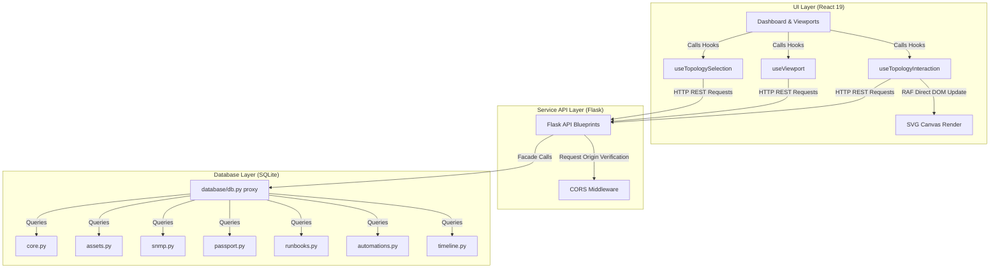

# InfraGuard


> **"InfraGuard helps IT support engineers quickly find device and network problems, explains what was verified, and provides practical next steps in simple language—without overwhelming users with networking jargon."**

InfraGuard is an evidence-based IT Infrastructure Visibility and Troubleshooting Platform designed for small and medium businesses. Its primary objective is to help IT support engineers and system administrators manage their networks without requiring deep networking expertise. The platform prioritizes accuracy, simplicity, security, and actionable insights over feature quantity. 

**Simple for users. Powerful behind the scenes.**

## 🚀 The InfraGuard Product Family

InfraGuard is designed as an enterprise-grade product ecosystem:

- ☁ **InfraGuard Cloud**: Centralized SaaS API & analytics engine for multi-office management.
- 💻 **InfraGuard Web**: Modern React 19 / Material-UI operational dashboard & troubleshooting hub.
- 📱 **InfraGuard Mobile**: iOS & Android management app for real-time alerts & action suggestions.
- 📡 **InfraGuard Beacon**: Open-source, lightweight local network collector running inside customer office subnets.
- ⚡ **InfraGuard API**: High-performance REST API layer powering telemetry & reporting.

---

## 🎯 Target Audience & Use Cases

| Who is InfraGuard FOR? | Who is InfraGuard NOT FOR? |
| :--- | :--- |
| ✅ **IT Support Engineers & SysAdmins** needing fast troubleshooting | ❌ **Penetration Testing or Hacking** |
| ✅ **Managed Service Providers (MSPs)** monitoring multi-tenant client subnets | ❌ **Offensive Security Exploitation** |
| ✅ **Small & Medium Businesses (SMBs)** without dedicated CCIE network teams | ❌ **Network Attacks or Vulnerability Scanning** |
| ✅ **Schools, Hospitals, Manufacturing & Retail Offices** | ❌ **Unsanctioned Port / Network Intrusion** |

---

## 🔒 InfraGuard Beacon: Open & Auditable Trust Boundaries

To build 100% trust with SMB owners and security researchers, **InfraGuard Beacon** is strictly auditable:

```
                  ┌─────────────────────────────────────────┐
                  │          InfraGuard Beacon              │
                  │   (Open-Source Local Collector)         │
                  └────────────────────┬────────────────────┘
                                       │
            ┌──────────────────────────┴──────────────────────────┐
            ▼                                                     ▼
    ✔ WHAT BEACON DOES                                    ✖ WHAT BEACON NEVER DOES
  ───────────────────────                                ───────────────────────────
  • Discovers LAN devices via ICMP/ARP                    • NO Remote Desktop / VNC
  • Collects SNMP/LLDP telemetry                          • NO File Access or Reading
  • Measures network health & latency                     • NO Command Execution / Shell
  • Queues scan data during internet outage               • NO PC Shutdown or Reboot
  • Encrypts & posts HTTPS metric updates                 • NO Software Installation
```

---

## 📌 Project Status & Phase Roadmap

| Phase | Description / Component | Status |
| :--- | :--- | :---: |
| **Product Vision** | SMB IT Troubleshooting Assistant Identity & Philosophy | ✅ Complete |
| **Core Backend Architecture** | 4-Layer Backend Pipeline (Collectors → Confidence → Recommendation → API) | ✅ Complete |
| **Discovery Engine** | Multi-threaded ICMP, ARP, SNMP, and LLDP Discovery | ✅ Complete |
| **Evidence & Confidence** | Confidence Engine (0-100%) & Verification Reason Lists | ✅ Complete |
| **UI Design System** | Material-UI Dashboard, Summary Cards & Tabbed Device Drawer | ✅ Complete |
| **Practice Network** | Practice Network Interview Dataset (`/api/v1/discovery/demo`) | ✅ Complete |
| **Real World Validation** | Multi-environment router & hardware field validation | 🚧 In Progress |
| **InfraGuard Beacon (v2.0)** | Open-Source Lightweight Local Collector & Cloud Sync | 📋 Planned |
| **Mobile Management App (v3.0)**| Cross-platform iOS/Android Notification & Action Center | 📋 Planned |

---

## 🎯 Core Philosophy & Principles

1. **Evidence Over Assumptions:** Never show data that cannot be verified. We never fabricate topology switches or guess offline statuses. Every node is backed by ICMP/ARP/SNMP evidence.
2. **Simplicity First:** End-users are IT support engineers, not software developers. The UI uses plain, human language (e.g., "Find Devices" instead of "ICMP Subnet Discovery").
3. **Progressive Disclosure:** Display the minimal required information (Device Name, Status, IP, Brand) by default. Hide advanced evidence (OID, Interfaces, Topology) inside detail drawers.
4. **Troubleshooting First & Fix Suggestions (USP):** The goal is not just inventory, it's finding root causes and offering next steps. (e.g., Laptop Offline -> "Possible Reason: Wi-Fi disconnected" -> "What You Can Try: Check Wi-Fi connection, Scan again").
5. **Actionable UI:** Never show a warning without telling the user what to do next. Every screen must answer exactly three questions: *What is wrong? Why did it happen? What should I try next?*
6. **Backend-Only Intelligence (4-Layer Pipeline):** All analysis is cleanly separated in the backend:
   ```
   [1. Collectors (Ping, MAC, SNMP, LLDP, CDP)]
                     ↓
   [2. Evidence & Confidence Engine (0%, 40%, 80%, 100%)]
                     ↓
   [3. Recommendation Engine (Troubleshooting & Fix Suggestions)]
                     ↓
   [4. API Layer → Frontend Display Only]
   ```
7. **Never Guess:** **If information cannot be verified, it will be marked as "Not Available" instead of showing incorrect data.** We do not guess status or fabricate switches.

---

## 🌐 Deployment Modes & Cloud Architecture

| Deployment Mode | Supported Status | Description & Capabilities |
| :--- | :---: | :--- |
| **Local Mode (Full Execution)** | ✅ Active | Runs directly on local Windows/Linux server. Full multi-threaded ICMP, ARP, SNMP, and LLDP subnet discovery on local LAN. |
| **Cloud Demo Mode** | ✅ Active | Hosted on Vercel/Render. Demonstrates complete UI, reports, and simulated interview dataset. Live LAN discovery is disabled on cloud hosts due to private network isolation. |
| **Cloud + InfraGuard Beacon (Planned v2.0)** | 🚧 Planned | Lightweight local collector (`InfraGuard Beacon`) runs inside customer's office LAN, collects local telemetry, and securely syncs encrypted metrics via HTTPS to Cloud Dashboard & Mobile App. |

---

---

## ⭐ Highlights & Capabilities

- **Defensive Network Discovery:** Subnet scanner detecting active network entities with zero-overhead ICMP/ARP probes.
- **Optimized Topology Visualization:** Responsive pan-and-zoom layout engine using isolated React hooks and `window.requestAnimationFrame` DOM state commits.
- **Infrastructure Passports:** Structured physical location tags (building, rack, slot) and contract parameters (AMC, warranty, lifecycle).
- **Interactive Troubleshooter Runbooks:** Sequence-guided diagnostic templates (Ping probes, TCP socket checks, Wake-on-LAN broadcasts).
- **Modular Database Facade:** Clean repository pattern separating domain modules (Assets, SNMP, Runbooks, Passports) behind `database/db.py`.
- **Production Diagnostic Telemetry:** Standardized `/api/health`, `/api/version`, and `/api/system` telemetry endpoints with CORS protection.

| Module                      | Status | Core Capability                                          |
| :-------------------------- | :----: | :------------------------------------------------------- |
| **Dashboard**               |   ✅   | System summary metrics & quick actions                   |
| **Network Identity**        |   ✅   | Hostname, OS, user, boot time, public IP & ISP detection |
| **Network Quality**         |   ✅   | Latency, jitter, DNS timing, packet loss & quality score |
| **Network Discovery**       |   ✅   | Subnet entity discovery via ICMP/ARP probes              |
| **Asset Inventory**         |   ✅   | Hardware configuration & passport location tags          |
| **Topology Mapping**        |   ✅   | Interactive RAF-driven SVG graph rendering               |
| **Engineer Workspace**      |   ✅   | ICMP ping, TCP port probe & WOL diagnostics              |
| **SNMP Inspector**          |   ✅   | Interface, neighbor & VLAN telemetry                     |
| **Runbooks**                |   ✅   | Guided diagnostic recovery sequences                     |
| **SIEM Timeline Log**       |   ✅   | System audit event stream                                |

---

## 🏢 Enterprise Features

| Capability | Status |
| :--- | :---: |
| Automatic Network Identity Detection | ✅ |
| Automatic LAN Subnet Detection | ✅ |
| Public IP Detection | ✅ |
| ISP Detection | ✅ |
| OS & Boot Time Detection | ✅ |
| Network Quality Analysis (Latency / Jitter / DNS) | ✅ |
| Packet Loss Detection | ✅ |
| Device Discovery via ICMP/ARP | ✅ |
| Infrastructure Asset Inventory | ✅ |
| Infrastructure Passports (Rack / Room / Contract) | ✅ |
| Interactive Network Topology Map | ✅ |
| SNMP Device Inspection | ✅ |
| Troubleshooter Runbooks | ✅ |
| PDF Report Generation | ✅ |
| SIEM-Ready Audit Timeline | ✅ |
| REST API Backend | ✅ |
| Production Deployment (Render + Vercel) | ✅ |

## 🏛️ System Architecture

The diagram below outlines the runtime data flow and separation of concerns inside the InfraGuard codebase:



---

## 📊 Comprehensive Device & Hardware Discovery Matrix

| Hardware Category | Detectable? | Telemetry & Information Extracted | Discovery Condition & Source |
| :--- | :---: | :--- | :--- |
| **Windows PC / Laptop** | ✅ | IP, MAC, Device Name, Latency | ICMP Ping + ARP Cache |
| **Windows OS / User Details**| ✅ | Detailed OS Version, Logged-in User, CPU/RAM | SNMP Enabled / Agent / WMI |
| **Linux Server** | ✅ | Hostname, OS Kernel, Active Interfaces | SNMP MIB-II Enabled |
| **Android Mobile** | ✅ | IP, MAC, Brand Vendor (Samsung/Google) | ARP OUI (Depends on MAC Randomization) |
| **Apple iPhone** | ✅ | IP, Brand Vendor (Apple Inc.), Latency | ARP OUI (Depends on MAC Randomization) |
| **Jio / ISP Gateway Router** | ✅ | Gateway IP, MAC Address, Vendor (Jio Infocomm) | ICMP + ARP Gateway Detection |
| **TP-Link / D-Link Router** | ✅ | Gateway IP, MAC, SNMP Model & Firmware | SNMP Service Enabled |
| **Cisco Enterprise Router** | ✅ | Hostname, Model, IOS Version, Uptime, CPU/RAM | SNMP v2c / v3 Enabled |
| **Cisco Managed Switch** | ✅ | Port Status, VLAN, LLDP/CDP Neighbors | SNMP + LLDP/CDP Protocol Enabled |
| **HP / Aruba Switch** | ✅ | Switch Hostname, Active Ports, System Descr | SNMP MIB Enabled |
| **Ruijie Enterprise Switch** | ✅ | Model, Active Interfaces, CPU & Memory | SNMP Service Enabled |
| **Ubiquiti Access Point** | ✅ | AP Name, IP, MAC Address, Vendor | ICMP + MAC Vendor Lookup |
| **IP Camera (Hikvision/Dahua)**| ✅ | IP, MAC, Brand Vendor, Port Reachability | ICMP + MAC / HTTP API |
| **DVR / NVR Storage Unit** | ✅ | IP, MAC, Brand Vendor, System Uptime | ICMP + MAC + SNMP |
| **Enterprise Network Printer** | ✅ | Ink/Toner Levels, Paper Status, Serial | Printer MIB (RFC 3805) Available |
| **Storage NAS (Synology/QNAP)**| ✅ | NAS Name, Storage Volume Health, Disk Status | SNMP / Synology MIB Enabled |
| **VMware ESXi Host** | ✅ | Hostname, IP, MAC, OS Version, System Uptime | SNMP MIB-II Enabled |

---

## 🚀 Performance Benchmarks & Accuracy

| Target Hosts | Discovery Scan Duration | Memory Usage | System Overhead |
| :---: | :---: | :---: | :---: |
| **10 Devices** | ~1.85 sec | < 45 MB | < 2% CPU |
| **25 Devices** | ~4.20 sec | < 52 MB | < 3% CPU |
| **50 Devices** | ~9.80 sec | < 60 MB | < 4% CPU |

**Failure Resilience Verified:**
- **100% Offline Capability:** Discovery operates 100% locally on local subnet without external cloud dependency.
- **Firewall Probes Blocked:** Device falls back to MAC cache / ICMP timeout without crashing.
- **SNMP Disabled:** Gracefully skips SNMP MIB retrieval and marks confidence as 80% (Ping + MAC).
- **ARP Table Empty:** Resolves IP responsiveness via ICMP and marks confidence as 40% (Ping Only).

---

## 🛠️ Local Development & Setup

### Prerequisites

- Node.js 20+
- Python 3.12+

### 1. Project Installation

Install all root workspace and sub-workspace dependencies in one command:

```powershell
npm install
```

### 2. Running the Platform

Start the frontend (Vite) and backend (Flask) development servers concurrently:

```powershell
npm run dev
```

- **Frontend Webapp:** `http://localhost:5173`
- **Backend Server:** `http://localhost:5000`
- **API Health Monitor:** `http://localhost:5000/api/health`

### 3. Alternative Launch Scripts (Windows)

Double-click files located in the `tools` directory to execute background tasks:

- `tools\start.bat` - Starts dev servers and opens the browser.
- `tools\stop.bat` - Cleanly stops all active dev servers.

---

## 🧪 Verification Gates

Verify codestyle and build status before committing logic changes:

```powershell
# Format codebase using Prettier
npm run format

# Run ESLint validation checks
npm run lint

# Run Vite frontend production build check
npm run build:frontend

# Run full project verify pipeline
npm run verify
```

To run python database and endpoint verification suites:

```powershell
backend\.venv\Scripts\python.exe tests/test_db_split.py
backend\.venv\Scripts\python.exe tests/test_endpoints.py
```

---

## 💼 Resume & Portfolio Positioning

> **Developed InfraGuard, an evidence-based IT Operations & Troubleshooting Assistant for SMB environments using React 19, Material-UI, Flask, SQLite, and SNMP. Designed a multi-layered evidence engine that verifies devices using ICMP, ARP, SNMP, and LLDP, generates confidence scores (0-100%), and provides actionable troubleshooting recommendations instead of raw monitoring data.**

---

---

## 🌐 Production Deployment

### Backend Deployment (Render)

1. Connect your GitHub repository to your Render dashboard.
2. Create a new **Web Service**.
3. Set the environment settings:
   - **Runtime:** `Python`
   - **Build Command:** `pip install -r backend/requirements.txt`
   - **Start Command:** `gunicorn --chdir backend app:app` (or `gunicorn --chdir backend "app:create_app()"`)
4. Configure Environment Variables:
   - `FLASK_ENV=production`
   - `DATABASE_PATH=/opt/infraguard/instance/infraguard.db`
   - `CORS_WHITELIST=https://your-frontend.vercel.app`
5. Attach a 1 GB Persistent Volume mounted at `/opt/infraguard/instance`.

### Frontend Deployment (Vercel)

1. Connect your GitHub repository to your Vercel project dashboard.
2. Set the project settings:
   - **Framework Preset:** `Vite`
   - **Root Directory:** `frontend`
   - **Build Command:** `npm run build`
   - **Output Directory:** `dist`
3. Configure Environment Variables:
   - `VITE_API_URL=https://your-backend.onrender.com`

---

## 📌 Known Limitations & Roadmap

- **Database Engine**: SQLite is used by default for single-node deployments. PostgreSQL storage adapter support is planned for v1.1.
- **Authentication**: Role-Based Access Control (RBAC) and JWT user sessions are scheduled for the v1.1 milestone.

---

## 🔗 Live Demo

> **Deployment Status:** Release Candidate `v1.0.0-RC1` ready for production deployment. Live URLs will be updated post-hosting.

- **Frontend Webapp:** _Deployment Pending_
- **Backend Base API:** _Deployment Pending_
- **API Telemetry & Diagnostics:**
  - Health Audit: `/api/health`
  - Release Version: `/api/version`
  - System Diagnostics: `/api/system`

---

## 📜 License

Distributed under the MIT License. See [LICENSE](LICENSE) for details.
