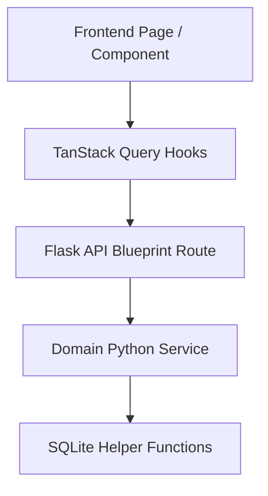

# InfraGuard Module Design Standard

Standard structure guidelines for creating a new InfraGuard module:

## 🛠 Structural Contracts

- **Routes Blueprint**: Translates JSON request bodies to variables. Catches internal domain exceptions, logs warnings, and structures standard HTTP responses.
- **Service Layer**: Implements core business logic, computes algorithms (e.g. warranty calculations, network ping parsing), and acts as the gatekeeper for system command tasks.
- **Database Layer**: Translates domain operations into SQL query strings with proper parameter bindings.
