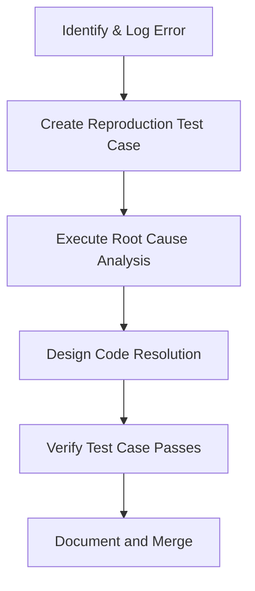

# InfraGuard Engineering Standards & Guidelines

This document serves as the official engineering handbook and development constitution for the **InfraGuard** platform. It defines the architectural constraints, coding style guidelines, security requirements, and workflow conventions that govern all contributions to the codebase.

---

## 1. Engineering Philosophy

To build a production-grade, highly resilient infrastructure visibility system, all engineers (and AI assistants) must adhere to these core cultural and technical tenets:

### A. Simplicity First (YAGNI & KISS)

- **The Principle:** You Aren't Gonna Need It (YAGNI). Do not build abstractions, features, or helper functions before they are actively required. Keep It Simple, Stupid (KISS).
- **Why:** Overengineering is the primary driver of development delays, hidden bugs, and high cognitive load for new developers. Simple, direct code is easier to audit, optimize, and maintain.

### B. Readability > Clever Code

- **The Principle:** Write code that reads like well-structured prose. Avoid highly compressed one-liners, complex nested ternary operators, or implicit type conversions that require mental parsing.
- **Why:** Code is read 10x more often than it is written. Writing readable code reduces onboarding time and prevents maintenance errors.

### C. Performance by Default (Not Premature Optimization)

- **The Principle:** Design with efficient computational complexity ($O(1)$ or $O(N)$) and minimal memory footprints from the start. Avoid operations that block the main JavaScript event loop or block Flask thread workers.
- **Why:** In an infrastructure platform managing thousands of network elements, poor algorithmic choices degrade dashboard responsiveness and database stability rapidly under scale.

### D. Security by Design

- **The Principle:** Treat every input as hostile. Security checks, sanitization, validation, and authorization must be implemented at the boundary layers (API handlers, database models) rather than assuming upstream data is safe.
- **Why:** A visibility platform that interacts with system binaries (like `ping` or `snmpwalk`) presents a high-value attack surface. Security cannot be bolted on as an afterthought.

### E. Modular Architecture & Clean Boundaries

- **The Principle:** Separate concerns strictly. The database layer does not know about HTTP requests; the API controller does not construct raw SQL; the frontend component does not construct API urls directly.
- **Why:** Loose coupling ensures that components can be swapped, tested, or refactored independently with minimal side-effects.

### F. High-Quality Developer Experience (DX)

- **The Principle:** Build reliable tooling, clear error messages, and automated scripts. A new developer must be able to clone the repository and run the full stack locally within 5 minutes.
- **Why:** Streamlined local development environments reduce friction, accelerate velocity, and boost team morale.

### G. Root Cause Analysis (RCA) Before Fixing

- **The Principle:** Never apply a patch to a bug without fully understanding _why_ the bug occurred and verifying it with a reproduction step.
- **Why:** Band-aid fixes often hide the true structural problem, leading to regression bugs or compounding technical debt.

---

## 2. Project Folder Structure

The repository operates as a monorepo utilizing npm workspaces to manage the React frontend and Flask backend as isolated packages, keeping dependencies isolated while sharing configurations and orchestration tools at the root level.

```text
infraguard/
├── .github/                   # CI/CD workflows and GitHub action configurations
├── ai/                        # AI-specific task boards and system constitutions
├── ai-workflow/               # Multi-agent pipelines and release checklists
├── assets/                    # Platform icons, architecture diagrams, and logos
├── backend/                   # Python Flask backend workspace
│   ├── .venv/                 # Python local virtual environment (git ignored)
│   ├── app/                   # Core application source
│   │   ├── database/          # Database connection, schemas, and queries
│   │   ├── routes/            # HTTP controller blueprints
│   │   ├── services/          # Pure business logic and external integrations
│   │   ├── settings.py        # Environment configuration loader
│   │   └── __init__.py        # Flask App factory
│   ├── instance/              # Local runtime database (git ignored)
│   ├── requirements.txt       # Python backend dependencies
│   └── package.json           # Backend npm workspace configuration script
├── configs/                   # Shared deployment and container settings
├── docs/                      # Technical specifications, user flows, and standards
├── frontend/                  # React 19 Vite application workspace
│   ├── dist/                  # Built static assets (git ignored)
│   ├── src/                   # React source code
│   │   ├── assets/            # Static images and UI resources
│   │   ├── components/        # Reusable UI component elements
│   │   ├── config/            # Sidebar menus and application metadata
│   │   ├── contexts/          # React Context providers (theme, auth)
│   │   ├── hooks/             # Custom React Query and UI hooks
│   │   ├── layout/            # Main application shell and nav layouts
│   │   ├── pages/             # Route-level page components
│   │   ├── schemas/           # Zod validation schemas
│   │   ├── services/          # API Client and network request layer
│   │   ├── theme/             # Material UI custom theme configurations
│   │   ├── App.jsx            # Main router and provider wrapper
│   │   ├── index.css          # Global styling tokens
│   │   └── main.jsx           # App entry point
│   ├── package.json           # Frontend dependencies and Vite scripts
│   └── vite.config.js         # Frontend compiler configuration
├── reports/                   # Exported CSV/PDF report output directory
├── sample_data/               # Mock data payloads for local testing
├── scripts/                   # Cross-platform administrative shell scripts
├── tests/                     # Multi-layer test suite directories
│   ├── backend/               # PyTest files for Flask endpoints
│   └── frontend/              # Vitest/Playwright tests for React components
├── tools/                     # Local developer automation tools (start/stop batch)
├── .gitignore                 # Workspace-wide git ignore rules
├── LICENSE                    # Software licensing agreement
├── package.json               # Monorepo workspaces definition configuration
└── README.md                  # Main developer setup guide
```

### Justification of Directory Design

- **Separation of `routes` and `services`:** Decouples Flask request/response parameters from core network utilities (e.g. SNMP parsing, subnet calculations).
- **Centralized `tests` Directory:** Keeps testing configuration unified, making it easier for CI/CD runners to parse code coverage metrics across both workspaces.
- **`shared` Configuration:** Future-proofs the monorepo for shared type definitions (TypeScript schemas) or common script parameters.

---

## 3. Architecture Rules

### A. Dependency Direction

- **Rule:** Dependencies must flow downward. High-level modules must not depend directly on low-level implementation details.

```
[HTTP Request] -> [Routes (Controller)] -> [Services (Business Logic)] -> [Database (Repository/SQL)]
```

- **Allowed:** A Route imports a Service. A Service imports a Database model or repository function.
- **Forbidden:** A Database helper imports a Route (creates a circular dependency). A component imports a database script directly.

### B. React Component Architecture

- **Rule:** Differentiate between Container Components (Pages) and Presentational Components (Common UI).
  - **Container Components (Pages):** Responsible for routing parameters, initiating React Query hooks, managing layout grid layouts, and passing callbacks down.
  - **Presentational Components:** Stateless and style-driven. They accept raw props and display the UI. They are completely decoupled from business logic and routing.
- **Forbidden:** Writing complex Axios calls or database-specific logic directly inside standard UI buttons or modal dialogs. Use hooks.

### C. Backend Service Layer

- **Rule:** All business logic must live inside `backend/app/services/`.
  - Flask route functions should contain _only_ request parameter parsing, validation execution, calling the appropriate service function, and returning JSON.
  - No SQL queries, subprocess command construction, or math functions should reside inside the route controller functions.

### D. Repository Pattern & Database Isolation

- **Rule:** All SQL queries and SQLite interactions must be encapsulated inside `backend/app/database/`.
  - Services must use database helper functions (e.g., `get_asset_by_id`, `save_discovery_results`) and must never construct raw SQL queries inside service files.
  - **Why:** This allows migrating from SQLite to PostgreSQL in the future by editing only the database module, leaving the services and route APIs completely untouched.

---

## 4. Coding Standards

### A. React & JavaScript/TypeScript Standards

- **File Naming:** Use PascalCase for components (e.g., `SnmpInspectorDialog.jsx`) and camelCase for hooks and services (e.g., `useAssets.js`, `apiClient.js`).
- **Hooks Standard:** Use custom hooks to isolate API queries. Never call `useQuery` or `useMutation` directly inside pages; wrap them in clean descriptive hooks (e.g., `useDiscoveryHistory()`).
- **Component Structure:**
  ```javascript
  // 1. Imports (External, Internal, Types)
  import React, { useState } from "react";
  import Box from "@mui/material/Box";
  import { useQuery } from "@tanstack/react-query";

  // 2. Constants
  const DRAWER_WIDTH = 240;

  // 3. Main Component
  export default function CustomPanel({ userId }) {
    // a. Hooks
    const { data } = useQuery(...);
    // b. State
    const [isOpen, setIsOpen] = useState(false);
    // c. Side Effects (useEffect)
    // d. Event Handlers
    const handleToggle = () => setIsOpen(!isOpen);

    // e. Render return
    return <Box>...</Box>;
  }
  ```

### B. Python & Flask Standards

- **Formatting:** Follow PEP 8 guidelines strictly. Use a formatter like `black` and a linter like `flake8` to enforce standard indentation and spacing.
- **Type Hinting:** Apply type annotations for all function signatures:
  ```python
  def execute_subnet_discovery(subnet_cidr: str) -> dict[str, any]:
      # Implementation...
  ```
- **Naming Conventions:**
  - Functions & Variables: `snake_case` (e.g. `detect_local_subnet`).
  - Classes: `PascalCase` (e.g. `NetworkUtility`).
  - Constants: `UPPER_SNAKE_CASE` (e.g. `DEFAULT_TIMEOUT_SEC`).
- **Import Order:**
  1. Standard library imports (e.g. `os`, `sys`, `subprocess`).
  2. Third-party library imports (e.g. `flask`, `pysnmp`).
  3. Local application imports (e.g. `from ..database import db`).

---

## 5. Code Quality Rules

To prevent code bloat and maintain a high standard of readability, the following metric limits are enforced across the codebase:

```
┌──────────────────────────────────────────────────────────┐
│                    CODE QUALITY LIMITS                   │
├──────────────────────────────┬───────────────────────────┤
│ Maximum File Size (Frontend) │  400 Lines                │
├──────────────────────────────┼───────────────────────────┤
│ Maximum File Size (Backend)  │  500 Lines                │
├──────────────────────────────┼───────────────────────────┤
│ Maximum Function/Component   │  80 Lines                 │
├──────────────────────────────┼───────────────────────────┤
│ Maximum Cyclomatic Complexity│  10                       │
├──────────────────────────────┼───────────────────────────┤
│ Duplicate Code Allowance     │  0% (Strict DRY)          │
└──────────────────────────────┴───────────────────────────┘
```

### A. Code Complexity & Abstraction

- **Cyclomatic Complexity:** Functions with more than 10 decision points (if-else statements, loops, switch blocks) must be broken down into sub-functions.
- **Magic Numbers:** All numerical values, hardcoded configuration keys, and status flags must be defined as variables or constants with descriptive names:
  - **Bad:** `if status == 3:`
  - **Good:** `if status == DEVICE_STATUS_OFFLINE:`

### B. Dead Code & Console Log Policy

- **Dead Code:** Unused components, variables, imports, and functions are forbidden. The CI pipeline will fail builds containing declared but unused code.
- **Console Logging:** No `console.log` or `console.error` calls are allowed in production frontend code. Use a centralized logging handler, error boundary, or toast notification.
- **Backend Logging:** Use Python’s built-in `logging` module. Never use `print()` statements for application logs. Assign logger categories:
  ```python
  logger = logging.getLogger("infraguard.services.discovery")
  logger.info("Discovery initiated...")
  ```

---

## 6. Performance Standards

### A. Frontend Optimization

- **Memoization:** Wrap expensive calculation blocks in `useMemo` (e.g., node list processing) and callback handlers in `useCallback` when passed to child components.
- **Route Splitting & Lazy Loading:** Every top-level page component in `App.jsx` must be loaded dynamically using `React.lazy` and wrapped in a `<Suspense>` boundary:
  ```javascript
  const TopologyPage = lazy(() => import("./pages/TopologyPage"));
  ```
  - **Why:** Drastically reduces the initial JS bundle size from 800+ kB to less than 150 kB, accelerating initial page rendering.
- **MUI Bundle Optimization:** Import Material UI components using named curly brackets to prevent bundling unused icons/components:
  - **Bad:** `import RouterIcon from "@mui/icons-material/Router";` (causes heavy tree-shaking overhead).
  - **Good:** `import { Router } from "@mui/icons-material";`

### B. Backend & Database Performance

- **Non-blocking Background Tasks:** Long-running processes (e.g., executing a ping sweep over a `/24` subnet or SNMP neighbor walks) must run asynchronously in worker threads or task queues. They must never block the Flask request thread.
- **DB Transactions:** Perform bulk writes (e.g., saving 254 scanned subnet IPs) in a single transaction blocks rather than individual queries:
  ```python
  # Bad: commits to disk 254 times
  for device in devices:
      cursor.execute("INSERT ...")
      conn.commit()

  # Good: single write operation commit
  cursor.executemany("INSERT ...", devices)
  conn.commit()
  ```

---

## 7. Security Standards

InfraGuard operates on local networks and must maintain strict defensive safeguards against administrative takeover.

### A. Authentication & Authorization

- **Strategy:** Implement Stateless JWT (JSON Web Tokens) generated via secure cryptographically random secret keys.
- **Storage:** Securely transmit tokens to the client and store them in secure HTTP-only cookies (`httpOnly: true, secure: true, sameSite: 'strict'`) to eliminate XSS-based token theft risks.
- **Authorization:** Enforce Role-Based Access Control (RBAC). Differentiate access between Read-Only (viewing maps) and Administrator (triggering runbooks and diagnostics).

### B. Secure Subprocess Executions (Command Injection Prevention)

- **Rule:** When calling system CLI commands (e.g., `ping`, `nslookup`), never format strings dynamically. Always pass arguments as clean array lists to `subprocess.run`:
  ```python
  # Safe construction
  cmd = ["ping", "-n", "4", target_ip]
  subprocess.run(cmd, shell=False)
  ```
- **Validation:** Use strict regex patterns to validate target IP addresses and CIDR blocks before calling commands:
  ```python
  import ipaddress
  # Validates input conforms to an actual IPv4 address
  ipaddress.ip_address(user_input_ip)
  ```

### C. CORS & CSRF Prevention

- **CORS:** Explicitly define backend CORS origins. Wildcards (`"*"`) are strictly forbidden in production.
  ```python
  CORS(app, resources={r"/api/*": {"origins": ["https://infraguard.domain.com"]}})
  ```
- **CSRF:** Validate JWT signatures in the header, or implement anti-CSRF double-submit tokens for all state-changing API endpoints (`POST`, `PUT`, `DELETE`).

---

## 8. Database Standards

The platform currently stores data in a local file-based SQLite database.

### A. SQLite WAL Mode Configuration

To support concurrent read operations while background tasks are writing to the database:

```python
conn.execute("PRAGMA journal_mode=WAL;")
conn.execute("PRAGMA synchronous=NORMAL;")
```

- **WAL Mode** provides high read concurrency and prevents database locking during background monitor runs.

### B. Future PostgreSQL Transition Plan

All database access must use parameterized bindings (`?` or `%s`). To support an easy PostgreSQL migration:

- Do not use SQLite-specific string formatting functions or unique SQLite extensions in SQL queries.
- Use standard ANSI SQL data types (`INTEGER`, `TEXT`, `VARCHAR`, `TIMESTAMP`).

---

## 9. Git Standards

### A. Branch Strategy (GitHub Flow)

- `main` — Represents the current stable production code.
- `develop` — The staging branch where features are integrated.
- `feature/feature-name` — Created from `develop` for individual feature implementations.
- `hotfix/issue-name` — Created directly from `main` to address critical production bugs.

### B. Commit Message Guidelines

Follow the Conventional Commits specification:

```text
<type>(<scope>): <subject>

[optional body]
```

- **Types:**
  - `feat`: A new feature implementation (e.g. `feat(topology): add node drag saving`).
  - `fix`: A bug resolution (e.g. `fix(discovery): sanitize cidr command flags`).
  - `docs`: Documentation changes.
  - `refactor`: Code improvements that do not change functionality.
  - `test`: Adding or correcting tests.

### C. Pull Request Acceptance Rules

To merge a PR into the `develop` or `main` branches, it must pass these conditions:

1.  All automated test suites (Jest/PyTest) must pass.
2.  Code coverage must not decrease.
3.  Approved reviews from at least one principal engineer.
4.  No linter errors or warnings.

---

## 10. Documentation Standards

A feature is not considered "done" until its corresponding documentation has been updated.

### A. Repository Markdown Essentials

- **`README.md`:** Must serve as a clear onboarding guide. It must contain architecture summaries, installation commands, environment variable setup steps, and troubleshooting sections.
- **`CHANGELOG.md`:** Follow the "Keep a Changelog" standard. Record all additions, changes, deprecations, and fixes grouped by version and release date.
- **`LICENSE`:** Standardize the repository under a clear open-source license template (e.g., MIT License) to ensure compliance.

### B. Visualizing Code

- Use **Mermaid diagrams** within markdown files to document complex user flows, database structures, and runtime thread communications:
  ```mermaid
  graph TD;
    A[React UI] -->|fetch| B[Flask API]
    B -->|query| C[SQLite Database]
    D[Monitoring Thread] -->|ping| E[Network Devices]
    D -->|write| C
  ```

---

## 11. Testing Standards

To maintain high confidence in the platform's stability, target test coverage must meet a minimum of **80% coverage** for all new service files.

### A. Multi-Layer Testing Strategy

1.  **Unit Tests (Python & JavaScript):** Validate utility and service files (e.g. validating subnet math, status calculations) without mocking networking.
2.  **API Integration Tests (PyTest):** Test database reads/writes, mock external HTTP client hooks, and evaluate API return payloads.
3.  **UI Component Tests (Vitest & React Testing Library):** Validate element rendering, form validations, and state changes.
4.  **End-to-End Testing (Playwright):** Simulate high-level user workflows (e.g., completing a discovery scan, dragging a node, downloading a PDF report).

### B. Mocking Policies

- **Strict Rule:** Network interfaces (like `socket.connect`, `subprocess.run`, `requests.get`) must always be mocked during tests. Tests must never run active network queries or ping external hosts.

---

## 12. Deployment Standards

### A. Separation of Frontend and Backend Runtimes

- **Frontend Deployments:** Hosted on CDN networks (Vercel, Netlify, Cloudflare Pages) as static assets.
- **Backend Deployments:** Hosted on platform-as-a-service providers (Render, Heroku, AWS ECS) supporting persistent Python containers.
- **Why:** Vite builds static HTML/JS bundles which can be served immediately via global edge networks, whereas Flask requires a continuous WSGI Python runner.

### B. Release Checklist (Strict Execution Order)

1.  Verify the production build locally (`npm run build`).
2.  Run full test suites and ensure 100% test success.
3.  Check that all secrets in production are set as environment variables (no `.env` file checked into Git).
4.  Draft a release tag (`vX.Y.Z`) on GitHub.
5.  Validate API routing proxy mappings in production environment.

---

## 13. Debugging Workflow

When a bug is reported, developers must execute a strict, non-destructive diagnostic cycle before modifying any code.



### A. The 5-Step Debugging Cycle

1.  **Identify:** Locate the exact line of code producing the error from server stack traces or browser stack reports.
2.  **Reproduce:** Write a local unit test or script that fails in the exact same manner as the reported bug.
3.  **Analyze (Root Cause):** Explain _why_ the code failed. (e.g. "The variable was undefined because the API returned a 404 response instead of an empty array").
4.  **Resolve:** Implement the fix.
5.  **Verify:** Run the test case to confirm it passes and ensure no other features are broken.

---

## 14. AI Development Workflow

AI assistants must operate as disciplined junior engineers. They must follow a strict design-first workflow and are forbidden from generating code directly without planning.

### The AI Implementation Cycle

1.  **Analyze Requirements:** Review user requests and verify compatibility with existing architectures.
2.  **Draft Design Plan:** Outline files to modify, new directories to create, and potential side-effects.
3.  **Perform Architecture & Security Reviews:** Check for circular dependencies, SQL/Command injections, and performance issues.
4.  **Write Implementation Plan:** Document the step-by-step code modification targets.
5.  **Execute Code Changes:** Write target modifications incrementally.
6.  **Verify & Test:** Run build compiler commands and verification tests.
7.  **Document:** Update markdown specifications, inline comments, and developer docs.

---

## 15. Engineering Checklists

### Before Every Commit

- [ ] Checked that no secrets or API keys are written in source code.
- [ ] Ensured no `.env` or `.db` files are staged for commit.
- [ ] Removed all temporary `console.log` statements.
- [ ] Executed static linter checks with zero warnings.

### Before Every Merge to Develop

- [ ] Verified that the project builds successfully.
- [ ] Confirmed all tests pass successfully.
- [ ] Verified that the pull request contains updated documentation.

### Before Every Deployment

- [ ] Verified that the CORS allowed origin list matches the production domain.
- [ ] Populated all required environment secrets on the hosting platform.

---

## 16. Best Practices

- **Fail Fast:** Let code raise descriptive exceptions immediately rather than trying to handle invalid configurations silently.
- **Write Code for the Next Developer:** Assume the next developer maintaining your code is a colleague who does not have context on your current task. Write self-explanatory code and document edge-case behaviors clearly.
- **Keep Pull Requests Small:** Aim for PRs that modify fewer than 200 lines of code. Small reviews are audited much more carefully than massive, multi-file code dumps.
