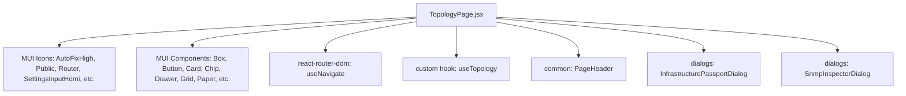
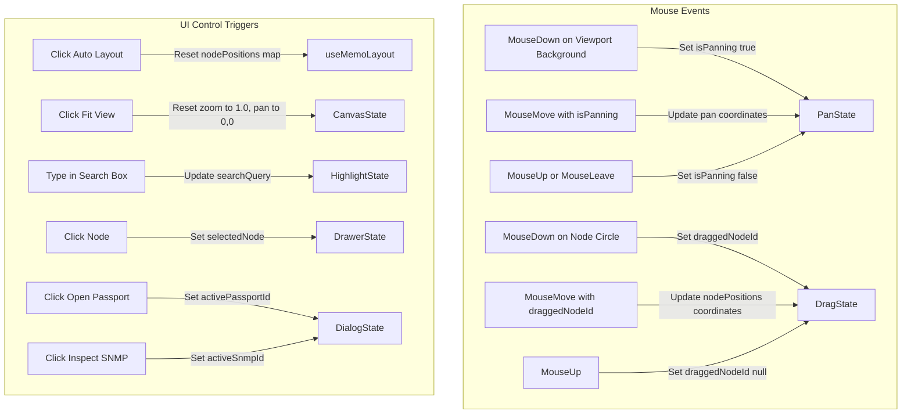

# TopologyPage Refactoring Analysis (Sprint 4A)

This document provides a comprehensive structural audit of `frontend/src/pages/TopologyPage.jsx` prior to Refactoring (Sprint 4).

---

## 1. Dependency Graph



---

## 2. Component Tree Layout

```
TopologyPage (Root Layout Container)
├── PageHeader (Title, subtitle, breadcrumbs)
├── Actions Bar (Buttons: Refresh, Auto Layout, Fit View, Export PNG)
└── Grid Container (Two-column layout)
    ├── Left Panel: Network Directory (3/12 width)
    │   ├── Directory Stats Cards (Routers, Switches, Servers, Offline counts)
    │   ├── Quick Search TextField
    │   └── Device List ScrollBox (List of interactive device items)
    │
    └── Right Panel: Graph Canvas (9/12 width)
        ├── Zoom / Pan Controls Overlay (Floating buttons: Zoom In, Zoom Out, Reset)
        ├── Custom Node Hover Tooltip (Conditional absolute floating Box)
        ├── SVG Viewport
        │   ├── Transform Group (Controls dynamic zoom & pan matrices)
        │   │   ├── Link Connection Paths (Animated motion circles for packets)
        │   │   └── Node Node Groups (Status borders, vector icons, hostname/IP texts)
        │   └── Dynamic Viewport Background rect (Captures background drag events)
        │
        ├── Legend Overlay (Bottom floating bar representing types and states)
        ├── Slide-out Properties Drawer (Property list, metric grids, quick actions)
        ├── InfrastructurePassportDialog (Modal for device metadata)
        └── SnmpInspectorDialog (Modal for SNMP port lists)
```

---

## 3. Hook Usage Matrix

| Hook Name                      | Instantiation Line | Purpose                                                                                            |
| :----------------------------- | :----------------- | :------------------------------------------------------------------------------------------------- |
| `useNavigate`                  | L54                | Navigation to `/workspace` terminal dashboard.                                                     |
| `useTopology`                  | L55                | Custom Query Fetcher. Extracts dynamic devices, LLDP link networks, loading and refreshing states. |
| `useState (searchQuery)`       | L62                | Manages string search queries for filtering/highlighting nodes.                                    |
| `useState (selectedNode)`      | L63                | Tracks currently active inspector drawer node context.                                             |
| `useState (activePassportId)`  | L64                | Controls display state of Infrastructure Passport modal.                                           |
| `useState (activeSnmpId)`      | L65                | Controls display state of SNMP port inspector modal.                                               |
| `useState (hoveredNode)`       | L68                | Tracks the node currently hovered by the pointer.                                                  |
| `useState (tooltipPos)`        | L69                | Updates coordinates `{ x, y }` for the SVG overlay tooltip.                                        |
| `useState (zoom)`              | L72                | Floating zoom multiplier value (restricted between $0.5\times$ and $2.0\times$).                   |
| `useState (pan)`               | L73                | Coordinates `{ x, y }` of the viewport panning transformation.                                     |
| `useState (isPanning)`         | L74                | Boolean state indicating if user is dragging the background.                                       |
| `useState (panStart)`          | L75                | Tracks coordinate offsets when a pan drag begins.                                                  |
| `useState (draggedNodeId)`     | L78                | ID of the node currently dragged by the user.                                                      |
| `useState (nodePositions)`     | L79                | Key-value store `{ [nodeId]: { x, y } }` for customized coordinates.                               |
| `useRef (svgRef)`              | L81                | References the SVG DOM element to compute bounds during dragging/exports.                          |
| `useMemo (nodes, links)`       | L84                | Calculates tree layout hierarchies, default spacing coordinates, and link lists.                   |
| `useMemo (counts)`             | L257               | Computes category quantities (routers, switches, servers, endpoints) on node changes.              |
| `useMemo (highlightedNodeIds)` | L323               | Memoizes search matches to filter highlighted outer rings.                                         |

---

## 4. State Flow & Event Mapping



---

## 5. SVG Render & Coordinate Math

### A. Level Hierarchy Calculations

Positions are calculated dynamically across 4 layout tiers (Levels):

- **Level 0 (Internet WAN):** Anchored statically at $(500, 50)$ (top center).
- **Level 1 (Routers):** Distributed horizontally across `Y = 140`. X-spacing is divided evenly based on total router count: `X = (index + 1) * (1000 / (count + 1))`.
- **Level 2 (Core Switches):** Positioned horizontally at `Y = 250`. (If no physical switches are discovered, a fallback virtual core switch is dynamically generated).
- **Level 3 (Endpoints / PCs):** Distributed horizontally along `Y = 370`.

### B. Link Curve Geometry

Connectors between nodes are rendered using smooth cubic Bézier curves. The control coordinates are derived from the vertical mid-points:
$$\text{midY} = \frac{src.y + tgt.y}{2}$$
$$\text{Path D} = \text{M } src.x, src.y \text{ C } src.x, \text{midY}, \text{ } tgt.x, \text{midY}, \text{ } tgt.x, tgt.y$$

### C. Animated Flows

SVG `<animateMotion>` nodes animate a target packet circle along the generated Bézier path:

```xml
<circle r="3.5" fill="#10B981">
  <animateMotion path={pathD} dur="3s" repeatCount="indefinite" />
</circle>
```

_(Flow is automatically paused/hidden if either the source or target node's status is "Offline")._

---

## 6. Target Refactoring Modularization Plan

In Sprint 4B, we will break this monolith into the following structured components:

1.  **`TopologyToolbar`:** Handles controls (Refresh, Auto Layout, Reset, Export PNG).
2.  **`TopologyDirectory`:** Network directory stats grid, search filtering input, and sidebar device list.
3.  **`TopologyCanvas`:** The SVG viewport rendering engine.
4.  **`TopologyLegend`:** Floating key overlay.
5.  **`TopologyDrawer`:** Slide-out property inspector sheet.
6.  **`useTopologyViewport`:** Custom hook isolating Zoom, Pan, Panning drag events, and bounds detection.
7.  **`useTopologyLayout`:** Custom hook isolating layout tree calculations (Levels 0–3 coordinates placement).
